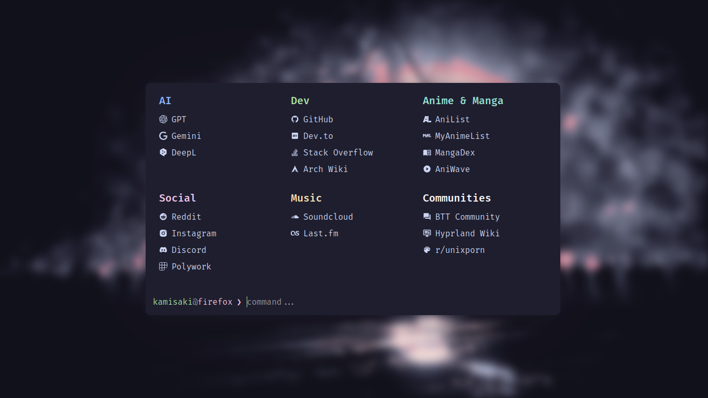
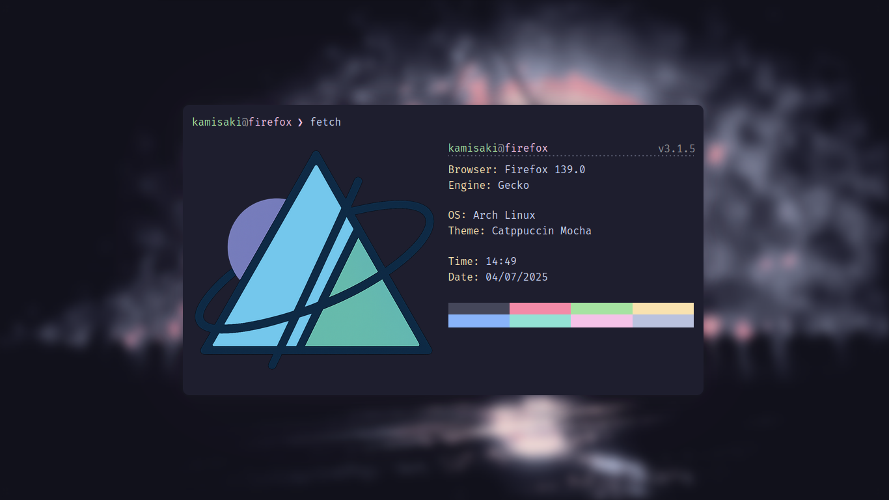

<div align="center">
	<h1 align="center">Nixus Start Page</h1>

|                           |                             |
| ------------------------- | --------------------------- |
|  |  |

My customized fork of [excalith/excalith-start-page](https://github.com/excalith/excalith-start-page)

[](https://nixus-start-page.vercel.app)

</div>

## Demo

You can explore the working version [here](https://nixus-start-page.vercel.app). To get inspired by community members' configurations, visit the [Showcase](https://github.com/excalith/excalith-start-page/discussions/categories/showcase) in discussions!

## Features

-   Filter links by typing in the prompt
    -   Quickly filter links by typing in the prompt. Hitting <kbd>Enter</kbd> will open all filtered links at once
    -   If nothing filtered, the text in prompt will use the default search engine for searching your input
-   Launch websites directly from the prompt. Just type the URL (ie. `github.com`)
-   Search websites with custom commands. For example, type `s some weird bug` to search StackOverflow for `some weird bug`
-   Wallpaper support through URL with blur and fade effects
-   Terminal window opacity and translucency effects
-   Customizable Fetch UI for fetching browser and system data, including custom image support
-   Autosuggest and Autocomplete support just like `zsh` and `fish`
-   Cycle through filtered links back and forth
-   Multiple theme support (check all [available themes](./data/themes/))
-   Built-in configuration editor to easily edit and save your configuration

### Built-In Commands

-   Show usage with `help` command (shows basic usage and your configured search shortcuts)
-   Show info with `fetch` command (time, date, system and browser data)
-   Update your configuration with `config` command
    -   `config help` - Displays config command usage
    -   `config import <url>` - Imports a configuration from URL
    -   `config theme` - Lists all [available themes](./data/themes/)
    -   `config theme <theme-name>` - Switches between themes and sets your local configuration
    -   `config edit` - Edit local configuration within editor
    -   `config reset` - Reset your configuration to default

### Key Bindings

-   Use <kbd>→</kbd> to auto-complete the suggestion
-   Search without auto-complete with <kbd>CTRL</kbd> + <kbd>ENTER</kbd>
-   Cycle through filtered links using <kbd>TAB</kbd> and <kbd>SHIFT</kbd> + <kbd>TAB</kbd>
-   Clear the prompt quickly with <kbd>CTRL</kbd> + <kbd>C</kbd>
-   Close windows with <kbd>ESC</kbd>

## Using

After cloning the repository locally, make any desired customizations and then:

```bash
yarn install
yarn build
yarn start
```

## Customization

This project, at its heart, supports customization to better suit your desktop environment. There are three methods to personalize the project according to your preferences:

You can either

-   **Method 1:** Configure your **fork** by editing [settings.json](./data/settings.json) file
-   **Method 2:** Use `config edit` command to edit on the fly, by built-in json editor
-   **Method 3:** Use `config import <url>` command to import your remote config file from your dotfiles repository

Check out the [Configuration](https://github.com/excalith/excalith-start-page/wiki/Configuration) and [Themes](https://github.com/excalith/excalith-start-page/wiki/Themes) wiki pages for more information regarding themes and configuration options.

## Thanks to excalith for the wonderful project

[excalith/excalith-start-page](https://github.com/excalith/excalith-start-page)
